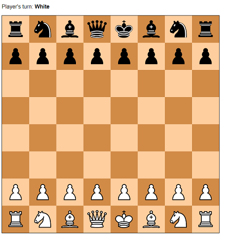
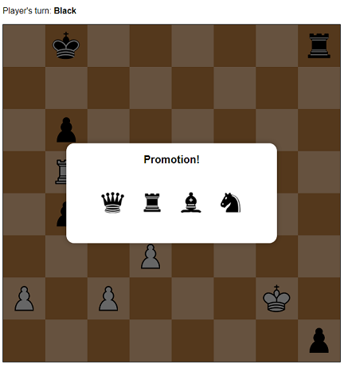

# Chess

Live Demo: https://mshvarts.github.io/Chess/

A two-player chess game written in JavaScript, HTML, and CSS. 
 
This project utilizes the open source chess engine from [Mshvarts](https://github.com/mshvarts/Chess)  

### Screenshot:  

